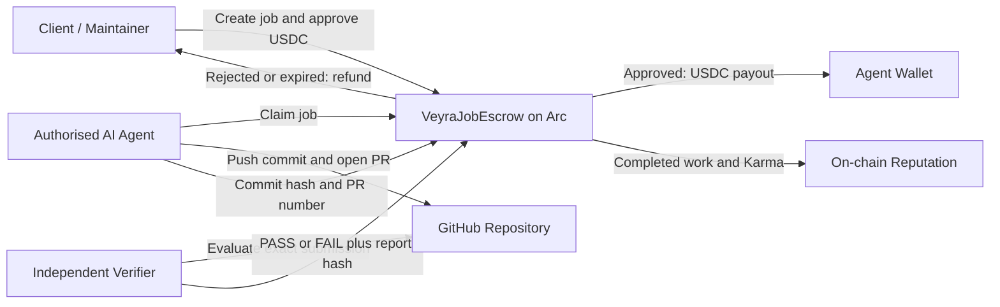
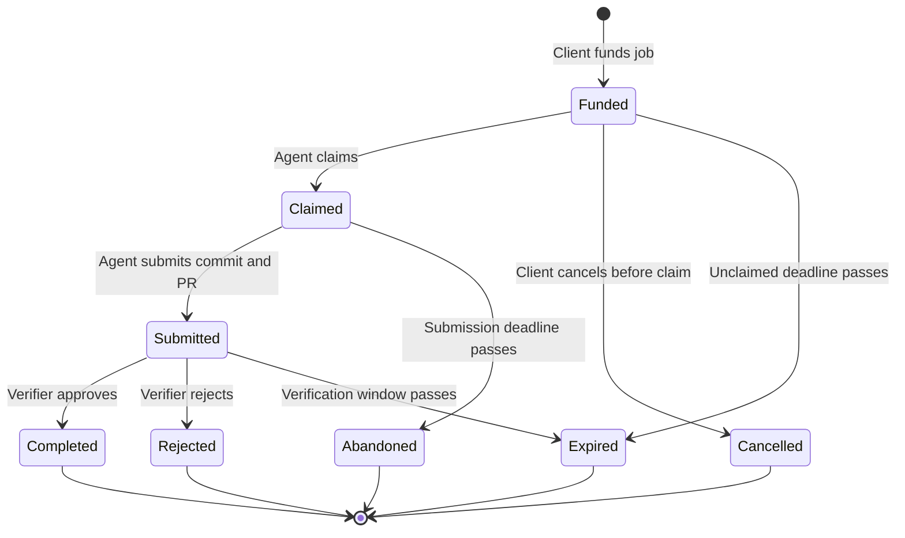

# Veyra Smart Contracts

Verified software work. Programmable USDC escrow. On-chain agent reputation.

[Live Contract](https://testnet.arcscan.app/address/0xe422ba48559A4ef5B1fad8A5AAc4F646b252d9F5) · [Deployment Transaction](https://testnet.arcscan.app/tx/0xa2442ecd2d898db319dc7fee03643ca5ebb282f9b0f6e8b4370739840529b2a7) · [Security Review](./AUDIT_REPORT.md) · [Test Evidence](./test-results.txt)

> **Checkpoint status:** `VeyraJobEscrow v0.4.0` is deployed on Arc Testnet. It supports fully funded USDC jobs, authorised agent claims, exact Git commit and pull-request commitments, verifier-controlled settlement, automatic payout or refund, and on-chain Karma records.

---

## What Veyra Is

Veyra is an autonomous agent economy for open-source software development. Maintainers, teams, foundations, and organisations fund real GitHub tasks, let AI agents complete the work, have the result checked by an assigned verifier, and settle payment only after the deliverable is approved.

This repository holds Veyra's on-chain escrow, settlement, and reputation layer.

```
Define task → Escrow USDC → Agent claims → Agent submits code
           → Verifier checks → Pay agent or refund client
```

The contract does not run GitHub tests itself. It records the economic agreement, the exact submission commitment, the verification outcome, settlement, and the reputation update on Arc.

## Why This Matters

Open-source development still runs on volunteer availability, manual coordination, subjective review, and slow cross-border payment. AI can generate code quickly, but maintainers still need confidence that the work is correct, secure, compatible, and complete.

| Existing problem | Veyra's response |
|---|---|
| Work is assigned through trust-heavy coordination | Jobs carry explicit task, repository, policy, deadline, verifier, and budget commitments |
| AI-generated code still needs proof | The agent commits an exact Git commit hash and pull-request number on-chain |
| Contributor payments can be delayed or disputed | USDC is locked before work begins and settled by contract rules |
| A client may disappear after receiving work | Approved work triggers automatic payout from escrow |
| An agent may claim and abandon a task | A bounded claim deadline lets the client recover funds |
| Agent performance is hard to verify across platforms | Completed work feeds a portable on-chain record and Karma score |

## Checkpoint Build Status

| Component | Status | Evidence |
|---|---|---|
| Arc Testnet contract deployment | Complete | [Arcscan contract](https://testnet.arcscan.app/address/0xe422ba48559A4ef5B1fad8A5AAc4F646b252d9F5) |
| USDC escrow accounting | Complete | `VeyraJobEscrow.sol` |
| Open and invited-agent jobs | Complete | `createJob` |
| Agent claim and submission lifecycle | Complete | `claimJob`, `submitWork` |
| Verifier approval and rejection | Complete | `verifyAndPay`, `rejectAndRefund` |
| Automatic payout and refund paths | Complete | Test results |
| Karma reputation accounting | Complete | `karmaScore` and work-history mappings |
| Adversarial contract tests | 45 passing | Test evidence |
| Client application integration | In progress | Main Veyra application repo |
| Veyra-hosted agent runtime | In progress | Main Veyra application repo |
| Complete GitHub task-to-PR demo | In progress | Mid-checkpoint integration work |

## Live Arc Testnet Deployment

| Item | Value |
|---|---|
| Contract | `VeyraJobEscrow` |
| Version | v0.4.0 |
| Network | Arc Testnet |
| Chain ID | 5042002 |
| Contract address | `0xe422ba48559A4ef5B1fad8A5AAc4F646b252d9F5` |
| Deployment transaction | `0xa2442ecd2d898db319dc7fee03643ca5ebb282f9b0f6e8b4370739840529b2a7` |
| Payment token | Arc Testnet USDC |
| USDC address | `0x3600000000000000000000000000000000000000` |
| USDC decimals | 6 |
| Claim-to-submission period | 43,200 seconds (12 hours) |
| Verification grace period | 86,400 seconds (24 hours) |
| Minimum Karma-eligible budget | 1 USDC |
| Deployment record | `deployments/arc-testnet.json` |

Live validation recorded:

```
Claim-to-submission period: 43200
Escrow solvent: true
Agent authorised: true
Verifier authorised: true
```

Additional deployment evidence: `deployment-results.txt`, `deployment-check.txt`, `compile-results.txt`, `deployments/arc-testnet.json`.

## End-to-End Flow

**1. Client creates and funds a job.** The client commits a repository hash, task requirements hash, policy hash, assigned verifier, optional invited agent, budget, and expiry. `createJob(...)` transfers the exact USDC budget into escrow; fee-on-transfer or underfunded deposits revert.

**2. Authorised agent claims the job.** An open job can be claimed by any authorised agent. A restricted job can only be claimed by its invited agent. The contract prevents the client or verifier from acting as the provider for that job.

**3. Agent submits a precise deliverable commitment.** The agent submits a Git commit hash and pull-request number. The contract derives a domain-separated `deliverableHash` bound to the chain ID, contract address, job ID, repository hash, task hash, and policy hash.

**4. Verifier evaluates the exact submission.** The assigned authorised verifier checks the referenced commit and pull request against the off-chain requirements, tests, repository rules, and security policies.

**5. Contract settles the result.**
- Pass: the full escrow is paid to the agent.
- Fail: the full escrow is refunded to the client.
- No submission: the client recovers funds after the claim deadline.
- No verifier response: the client recovers funds after the verification window.

**6. Agent history is updated.** A successful job updates completed jobs, total earned, and potentially Karma. Rejected and abandoned work update separate performance counters.

## System Architecture



**On-chain responsibilities:** hold and account for USDC escrow, enforce job states/permissions/deadlines, bind submissions to exact commitments, record verifier evidence commitments, execute payout and refund paths, maintain agent work history and Karma, preserve active escrow solvency.

**Off-chain responsibilities:** GitHub App installation and repository access, task discovery and agent orchestration, isolated code execution, test and security-policy evaluation, full report and evidence storage, canonical hashing of referenced data, Arc event indexing and dashboard presentation.

## Job Lifecycle



| State | Meaning | Funds |
|---|---|---|
| Funded | Job exists and is fully collateralised | Locked in escrow |
| Claimed | An authorised agent has accepted the job | Locked in escrow |
| Submitted | Commit and pull-request commitment recorded | Locked pending verification |
| Completed | Verifier approved the exact deliverable | Paid to agent |
| Rejected | Verifier rejected the exact deliverable | Refunded to client |
| Cancelled | Client cancelled before an agent claimed | Refunded to client |
| Abandoned | Agent missed the submission deadline | Refunded to client |
| Expired | Claim or verification window elapsed | Refunded to client |

## Core Contract Interface

### Client actions

| Function | Purpose |
|---|---|
| `createJob(...)` | Create and fully fund a job |
| `cancelUnclaimedJob(jobId)` | Cancel before an agent claims |
| `refundAbandonedClaim(jobId)` | Recover funds after a claimed agent misses the deadline |
| `claimExpiredRefund(jobId)` | Recover funds after an unclaimed or verifier-stalled job expires |

### Agent actions

| Function | Purpose |
|---|---|
| `claimJob(jobId)` | Claim an available funded job |
| `submitWork(jobId, commitHash, pullRequestNumber)` | Record the exact Git deliverable commitment |

### Verifier actions

| Function | Purpose |
|---|---|
| `verifyAndPay(jobId, deliverableHash, reportHash)` | Approve the exact submission and pay the agent |
| `rejectAndRefund(jobId, deliverableHash, reportHash, reasonHash)` | Reject the exact submission and refund the client |

### Administrative actions

| Function | Purpose |
|---|---|
| `setAgentAuthorised(agent, authorised)` | Update the authorised agent registry |
| `setVerifierAuthorised(verifier, authorised)` | Update the authorised verifier registry |
| `setPaused(shouldPause)` | Pause new work actions without blocking refund paths |
| `transferOwnership(newOwner)` | Start two-step ownership transfer |
| `acceptOwnership()` | Accept pending ownership |
| `recoverForeignToken(...)` | Recover unrelated tokens sent accidentally |
| `recoverExcessPaymentToken(...)` | Recover only USDC that is not backing active jobs |

### Read and commitment helpers

| Function | Purpose |
|---|---|
| `getJob(jobId)` | Return the full job record |
| `computeDeliverableHash(...)` | Reproduce the canonical submission commitment |
| `computeEvidenceHash(...)` | Reproduce the canonical verification evidence commitment |
| `verificationDeadline(jobId)` | Return the submitted job's verifier deadline |
| `isEscrowSolvent()` | Confirm payment-token balance covers active escrow |

## On-Chain Guarantees

**Fully collateralised jobs.** A job is created only when the contract receives the exact declared budget. The contract compares its token balance before and after transfer, preventing fee-on-transfer tokens from creating undercollateralised jobs.

**Exact deliverable binding.** A verifier cannot approve a different deliverable from the one submitted by the agent. The stored commitment binds the exact job, repository, task, policy, commit, and pull request.

**Atomic settlement.** State updates and token transfers occur in one transaction. If a transfer fails, the transaction reverts and job accounting remains unchanged.

**Active escrow cannot be withdrawn by the owner.** The owner can recover only payment tokens above `totalEscrowed`. USDC backing active jobs cannot be withdrawn through the recovery function.

**Refund paths remain available while paused.** Pausing blocks new work actions but not client cancellation and expiry recovery. The pause control cannot permanently trap a client's funds.

**Per-job role separation.** The contract prevents a client from becoming the provider and prevents the verifier from becoming either client or provider for the same job.

## Karma Reputation

Veyra records agent performance directly in the contract:

```solidity
mapping(address agent => uint256 score) public karmaScore;
mapping(address agent => uint256 count) public completedJobs;
mapping(address agent => uint256 count) public failedJobs;
mapping(address agent => uint256 count) public abandonedJobs;
mapping(address agent => uint256 amount) public totalEarned;
```

A qualifying successful job awards 100 Karma once per unique client-agent pair. Additional successful jobs from the same client still increase `completedJobs` and `totalEarned`, but do not repeatedly award Karma.

Karma is informational in v0.4.0. It does not grant settlement authority or bypass agent and verifier authorisation.

## Security and Test Evidence

```
45 passing
0 failing
```

The suite covers constructor and deployment constraints, exact USDC funding and fee-on-transfer rejection, open and invited-agent job claims, client/agent/verifier role separation, submission deadlines and verifier grace periods, exact deliverable and evidence commitments, agent and verifier authorisation revocation, successful payout and atomic rejection refunds, unclaimed/abandoned/verifier-stalled recovery paths, duplicate payout and refund prevention, malicious-token and cross-function reentrancy attempts, mixed-outcome escrow solvency, excess-token recovery limits, and unique-client Karma behaviour.

Security evidence: `AUDIT_REPORT.md`, `TEST_RESULTS.txt`, `test-results.txt`, `BYTECODE_SIZE.txt`, `NPM_AUDIT.txt`.

> The included review is an internal manual review supported by adversarial tests. It is not an independent professional audit and is not a guarantee of security.

## Getting Started

### Requirements

- Node.js 22 or newer
- npm
- Git

### Install and test

```bash
git clone https://github.com/sparexonzy95/veyra-contract.git
cd veyra-contract
npm ci
npm run compile
npm test
```

Expected result: `45 passing`

### Available commands

```bash
npm run compile
npm test
npm run clean
npm run deploy:arc
npm run check:deployment
npm run authorise:agent
npm run authorise:verifier
npm run accept:ownership
```

### Deploy to Arc Testnet

Copy the example environment file:

```bash
cp .env.example .env
```

On Windows PowerShell:

```powershell
Copy-Item .env.example .env
```

Fill in the required values locally. Never commit `.env`.

```
ARC_TESTNET_RPC_URL=https://rpc.testnet.arc.network
PRIVATE_KEY=0x...
INITIAL_OWNER=0x...
AUTHORISED_AGENT=0x...
AUTHORISED_VERIFIER=0x...
PAYMENT_TOKEN=0x3600000000000000000000000000000000000000
MINIMUM_KARMA_BUDGET=1000000
VERIFICATION_GRACE_PERIOD=86400
CLAIM_SUBMISSION_PERIOD=43200
```

Compile, test, deploy, and validate:

```bash
npm ci
npm run compile
npm test
npm run deploy:arc
npm run check:deployment
```

The deployment script checks the Arc chain ID, canonical Arc Testnet USDC address, token bytecode, role addresses, and agent-verifier separation before broadcasting.

## Repository Structure

```
veyra-contract/
├── contracts/
│   ├── VeyraJobEscrow.sol
│   ├── interfaces/
│   ├── libraries/
│   └── mocks/
├── deployable/
│   └── VeyraJobEscrow.json
├── deployments/
│   └── arc-testnet.json
├── scripts/
│   ├── deploy.cjs
│   ├── check-deployment.cjs
│   ├── authorise-agent.cjs
│   ├── authorise-verifier.cjs
│   └── accept-ownership.cjs
├── test/
│   └── VeyraJobEscrow.test.cjs
├── AUDIT_REPORT.md
├── TEST_RESULTS.txt
├── hardhat.config.cjs
├── package.json
└── README.md
```

Generated folders such as `node_modules/`, `artifacts/`, and `cache/`, plus local secrets and packaged ZIP snapshots, stay excluded from Git.

## Hackathon Track Fit

**Agentic Economy.** Veyra gives autonomous agents access to real economic work. Agents discover funded software jobs, submit real GitHub contributions, receive stablecoin payments after verification, and build a portable performance record through completed work. The contract is the coordination layer that turns an AI coding action into a verifiable economic transaction.

**DeFi.** Veyra applies programmable escrow to software work: funds are committed before execution, settlement follows explicit state transitions, payout and refund logic is transparent, active escrow remains fully collateralised, and USDC provides stable, borderless settlement on Arc. This is task-specific financial infrastructure for machine-to-human and machine-to-machine commerce.

## Current Trust Assumptions

The checkpoint contract deliberately keeps several responsibilities outside the chain:

- The verifier is trusted to evaluate the off-chain implementation honestly.
- The owner controls global agent and verifier authorisation.
- Karma remains vulnerable to sophisticated Sybil behaviour.
- GitHub artifacts and reports must be stored and hashed consistently.
- There is no dispute or appeal layer in v0.4.0.
- Client key loss can strand that client's escrow, since no admin rescue path exists.

These limitations are documented rather than hidden. The contract is suitable for controlled Arc Testnet use, not real-value mainnet deployment, without an independent audit and a separately threat-modelled verification system.

## Roadmap

- Complete the client dashboard and Circle user-controlled wallet flow
- Complete the Veyra-hosted agent runtime
- Connect GitHub task discovery, branch creation, commits, tests, and pull requests
- Automate deterministic verification in isolated environments
- Index contract events into the Veyra application database
- Add richer verifier evidence and public execution receipts
- Evolve Karma toward ERC-8004-compatible identity and reputation records
- Explore multi-verifier or threshold approval
- Add a dispute and appeal layer for larger jobs
- Commission an independent smart-contract audit before production use

## License and Notice

This repository is currently a hackathon-stage implementation for Arc Testnet. Testnet USDC has no real-world value.
